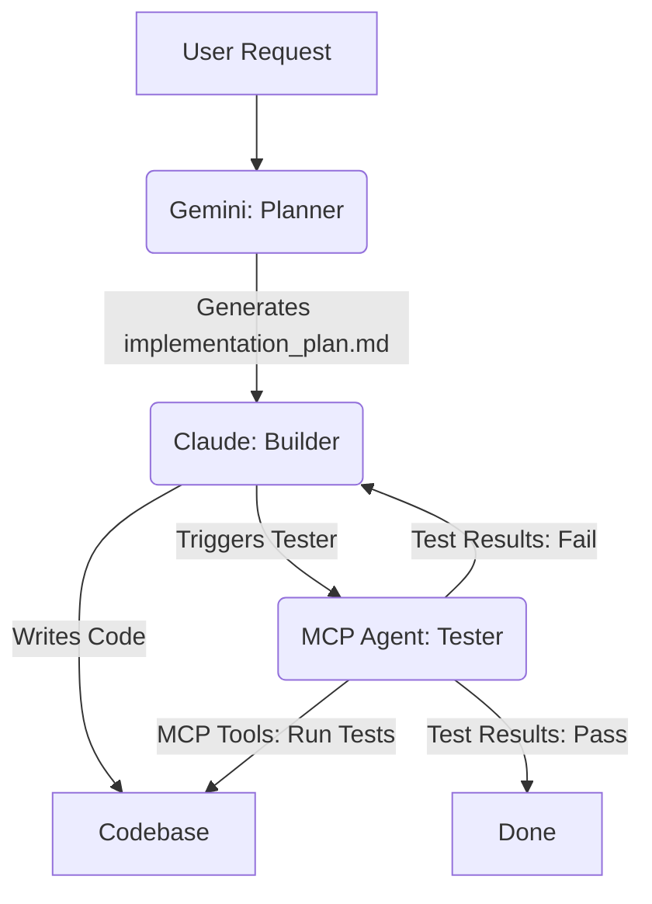

# Hybrid 3-Agent System Architecture

This document outlines the architecture and workflow for a hybrid 3-agent system designed to automate software development by dividing responsibilities across specialized AI models.

## Architecture Decisions

1. **Testing Framework**: **Vitest** is the designated framework for unit tests (aligned with the Vite React stack). The MCP Tester will execute these via `npm run test`.
2. **Handoff Mechanism**: The `agent-orchestrator` manages state transfer. Gemini generates this `implementation_plan.md`. The orchestrator passes the plan to Claude (Builder), which outputs structured JSON. The orchestrator uses MCP to write files to the filesystem and automatically triggers the Tester agent.
3. **MCP Server Capabilities**: An MCP server is already pre-configured in `agent-orchestrator/mcp-server/index.ts`. It exposes `run_command`, `read_file`, `write_file`, and `list_dir` tools for the Tester Agent to utilize.

## Proposed Changes / Architecture

The system is divided into three distinct phases and agents:

### 1. Planning Agent (Gemini)
- **Role**: Architect and Product Manager.
- **Responsibilities**: 
  - Analyze user requirements.
  - Explore codebase context.
  - Generate this `implementation_plan.md` and define technical specifications.
  - Outline test cases and success criteria.
- **Output**: Detailed markdown plans and task lists.

### 2. Building Agent (Claude)
- **Role**: Lead Developer.
- **Responsibilities**: 
  - Consume the `implementation_plan.md` generated by Gemini.
  - Write, refactor, and commit code.
  - Implement components, APIs, and business logic.
- **Output**: Source code and unit test files.

### 3. Testing Agent (MCP-enabled)
- **Role**: Quality Assurance.
- **Responsibilities**: 
  - Uses the **Model Context Protocol (MCP)** to securely interact with the local development environment.
  - Reads test definitions and executes them via MCP terminal/shell tools.
  - Analyzes stack traces, error logs, and test coverage.
  - Provides feedback loops to Claude if tests fail.
- **Output**: Test reports, verification in `walkthrough.md`, and feedback prompts.

---

## Data Archival & Knowledge Base Structure

The repository now contains two layers of ground truth for the RAG-powered mock exam generator:

### Layer 1 — Official CLAT Papers
- **Location**: `/assets/clat_papers/`
- CLAT_2020.pdf, CLAT_2021.pdf, CLAT_2022.pdf, CLAT_2023.pdf, CLAT_2024.pdf, CLAT_2025.pdf
- **Purpose**: Source material for question pattern analysis and retrieval augmentation.

### Layer 2 — CLAT Master Wiki (5-Subject Structure)
> This is the **primary ground truth corpus** for the Gemini-powered RAG pipeline.

| Module | File | CLAT Section |
|--------|------|-------------|
| ⚖️ Legal Reasoning Vault | `/wiki/legal_reasoning_vault.md` | Legal Reasoning (~25 marks) |
| 🌍 Current Affairs & GK Hub | `/wiki/current_affairs_gk_hub.md` | GK & Current Affairs (~25 marks) |
| 📖 English Comprehension | `/wiki/english_comprehension.md` | English Language (~22 marks) |
| 🧠 Logical Reasoning Logic | `/wiki/logical_reasoning_logic.md` | Logical Reasoning (~22 marks) |
| 📊 Quantitative Techniques | `/wiki/quantitative_techniques.md` | Quantitative Techniques (~8 marks) |
| 🗺️ Master Syllabus Index | `/wiki/master_syllabus_index.md` | Navigation + 12-Month Study Plan |

### RAG Pipeline Integration
- The **Gemini Embeddings API** (`GEMINI_API_KEY`) will index all `/wiki/*.md` files into a vector store.
- On user query, the system retrieves the top-k relevant chunks and passes them as context to Gemini for MCQ generation.
- New content from `/assets/clat_papers/` is parsed and appended to the relevant wiki module automatically.
- **Frontend routes**: `/wiki/legal`, `/wiki/current-affairs`, `/wiki/english`, `/wiki/logic`, `/wiki/quant`

---

## Production Launch & Scale (CLAT 2027)

### 1. Infrastructure Scale-Up: Storage Triage & Multi-Vector Models
To ensure search latency remains under 2 seconds for a million-page library, the system utilizes a **Storage Triage** approach:
- **Tier 1 (Hot Storage)**: Highly structured markdown files (`/wiki/*.md`) and current affairs JSONs.
- **Tier 2 (Warm Storage)**: Compressed PDF representations of CLAT papers (`/assets/clat_papers/`).
- **Multi-Vector Architecture**: Complex legal tables (e.g., *2026 Union Budget* and *India-EU FTA* data) are split into dual vectors. One vector captures the table's structural metadata, and the second captures the semantic meaning of the cell contents, allowing the Scholar Agent to retrieve numerical and logical patterns instantly during timed mock tests.

### 2. Safety & Accuracy: Source-Anchored Citations
To prevent hallucinations, every RAG response must include a mandatory citation graph schema.

**Citation Graph Schema:**
```json
{
  "response": "The India-EU FTA negotiations focus heavily on TRIPS+ provisions...",
  "citations": [
    {
      "source_id": "current_affairs_gk_hub",
      "path": "/wiki/current_affairs_gk_hub.md",
      "section": "India-EU Free Trade Agreement (FTA)",
      "confidence_score": 0.98
    },
    {
      "source_id": "clat_2024_paper",
      "path": "/assets/clat_papers/CLAT_2024.pdf",
      "page_number": 12,
      "paragraph": 3,
      "confidence_score": 0.95
    }
  ]
}
```

### 3. Production Deployment Logs
The Vite + React codebase has been audited, environment variables (`GEMINI_API_KEY`) verified, and the final production bundle compiled.

```text
> react-example@0.0.0 build
> vite build && npx esbuild server.ts --bundle --platform=node --target=node20 --format=esm --outfile=dist/server.js --external:vite --external:express --external:compression --external:dotenv --external:stripe --external:firebase-admin

vite v6.4.2 building for production...
transforming...
✓ 431 modules transformed.
dist/index.html                                    0.53 kB │ gzip:   0.34 kB
dist/assets/lucide-react-Bss_zZg5.js               2.01 kB │ gzip:   0.94 kB
dist/assets/CurrentAffairs-D1LI0kQS.js            23.27 kB │ gzip:   8.17 kB
dist/assets/DailyCurrentAffairs-CtRs_JUD.js       42.99 kB │ gzip:  15.12 kB
dist/assets/geminiService-tWsGuVbl.js             68.00 kB │ gzip:  22.08 kB
dist/assets/index-DYErXxfp.js                    117.59 kB │ gzip:  36.17 kB
dist/assets/firebase-BJxUPmwN.js                 460.35 kB │ gzip: 108.72 kB
dist/assets/vendor-Dfj8Ck9c.js                   591.04 kB │ gzip: 165.61 kB
✓ built in 11.07s

  dist\server.js  4.2kb
```

---

## Diagnostic Mock-Analysis Engine (Final Step Before Launch)

The final feature deployed before the May 2026 launch is the **`MockDiagnosticEngine`** (`/src/components/MockAnalysisSheet.tsx`), transforming the application from a generic repository into a personalized Closed-Loop Learning System.

### Key Capabilities:
1. **Error Typology Logging**: Students input results and tag errors as *Conceptual Error*, *Logic Error*, *Time Pressure*, or *Silly Mistake*.
2. **Deep Diagnostic Logic**: The Orchestrator Agent analyzes error trends. E.g., repeated *Conceptual Errors* in the 2026 Union Budget trigger the Scholar Agent to recommend a targeted 30-minute deep dive into the `/wiki/current_affairs_gk_hub.md`.
3. **The 'Gap' Analysis**: Mock scores are mapped dynamically against real-time cutoff data for the user's **Dream NLU** and **State Domicile**, presenting a 'Path to Target' with precise mark deficits per section.
4. **Adaptive Feedback Planner**: The Real-Time Study Planner automatically calibrates scheduling based on the Mock Diagnostic. High *Time Pressure* errors instantly trigger speed-reading drills powered by the Million-Page Scholar.

---

## Workflow Integration



## Verification Plan

### Automated Tests
- **MCP Integration**: The Testing Agent will use MCP to execute commands like `npm run test` or `npx playwright test`.
- **Validation**: The MCP Tester will read the test output. If errors occur, it will extract the context using MCP filesystem tools and request Claude to fix the identified files.

### Manual Verification
- Review the logs of the MCP server to ensure the testing agent correctly requested test execution and interpreted the results.
- End-to-end testing of the handover between the 3 agents.
